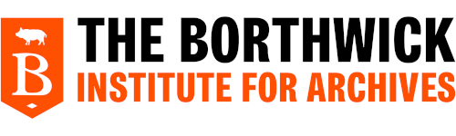

This section is dedicated to the resources available to researchers and students with regard to Alan Ayckbourn, Stephen Joseph and Theatre in the Round in Scarborough. It is affiliated to The Borthwick Institute for Archives at The University of York where the Ayckbourn Archive is held.

### The Ayckbourn Archive

The Ayckbourn Archive at The Borthwick Institute for Archives is the world's largest public archive relating to Alan Ayckbourn containing manuscripts, correspondence, programmes, multi-media, publicity materials and more.   

### The Library Theatre / Stephen Joseph Collection at Scarborough Library

The Library Theatre / Stephen Joseph Collection at Scarborough Library holds a significant collection relating to the UK's first professional theatre-in-the-round, founded by Stephen Joseph in 1955 at Scarborough Library, where Alan Ayckbourn made his debut as a playwright and director. The collection includes correspondence, programmes and photographs relating to The Library Theatre (1955 - 1976) as well as material relating to the Stephen Joseph Theatre in the Round (1976 - 1996).

### The Ayckbourn Collection at Scarborough Museums & Galleries

The Ayckbourn Collection is a small but significant collection of archival material pertaining to Alan Ayckbourn and his relationship with his adopted home town of Scarborough. It was donated by Sir Alan Ayckbourn and Simon Murgatroyd in 2023 and will be potentially expanded in the future.

### Other Significant Research / Archival Resources

### Online Resources
