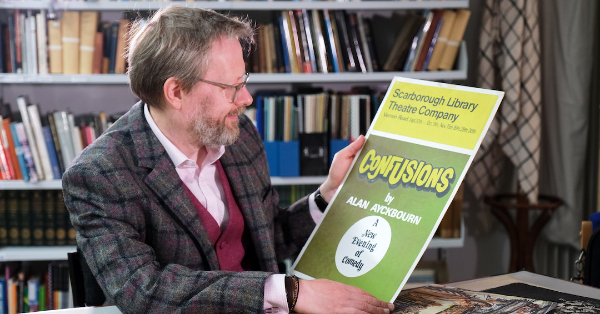

*These pages relate to the Ayckbourn Collection at Scarborough Museums & Galleries. This is a curated collection of material relating to Alan Ayckbourn, Stephen Joseph and the development of theatre in the round in Scarborough donated to the town by the playwright and his archivist, Simon Murgatroyd.*

### The Ayckbourn Collection Announcement

*18 August 2023*

<aside>

### Related Pages

*Alan Ayckbourn's Archivist, Simon Murgatroyd, with one of the pieces from the Ayckbourn Collection (© Tony Bartholomew)*

</aside>

An important collection of items relating to the theatrical giant Alan Ayckbourn and the history of theatre-in-the-round in Scarborough has been donated to Scarborough Museums and Galleries by the playwright himself and by his Archivist, and much of it will go on display at Scarborough Art Gallery from Saturday 16 September.

Objects include a rare original script of the writer’s first ever play, *The Square Cat*, and a 1970s portrait of Ayckbourn by ‘kitchen sink’ artist John Bratby, which went on public display for the first time ever at the gallery earlier this year when it was loaned to SMG as part of the portrait exhibition *Who Am I?*, but now becomes a permanent part of the SMG collections.

In the donation are also a complete collection of original actors’ manuscripts for Ayckbourn’s *The Norman Conquests*, which celebrates its 50th anniversary in 2023.

Other items include material relating to the founding of the theatre-in-the-round in Scarborough by the man whose name it now bears, Stephen Joseph, including his set plans for Harold Pinter’s directorial debut, *The Birthday Party*, which rehearsed in Scarborough, as well as personal items of his including scrapbooks and letters.

One item of particular interest to theatre historians is Stephen’s plans for a ‘fish-and-chips theatre’ - a theatre with a fish and chip bar attached, with patrons being encouraged to take their fish supper into the show.

Both the Bratby portrait and plans for a ‘fish-and-chips theatre’, along with other items from the 50-strong collection, will now go on display at Scarborough Art Gallery.

Andrew Clay, Chief Executive of SMG, says: “The Ayckbourn gift is an important moment for Scarborough Museums and Galleries. Theatre and entertainment are a central part of Scarborough’s story, from the golden age of the seaside holiday when performance spaces abounded, to modern Scarborough where the Stephen Joseph Theatre has an international reputation for excellence. The Scarborough Collection includes nearly 200 years of theatre-related objects and memorabilia so to add this gift is a particularly joyful moment for SMG. We are enormously grateful to Sir Alan and Lady Ayckbourn, and to Simon Murgatroyd, for this gift and their immeasurable contribution to the cultural life of Scarborough.”

Alan Ayckbourn’s Archivist, Simon Murgatroyd, who facilitated and curated the donation and has donated several items from his own personal collection, says: “As someone passionate about both the history of theatre in the round and Scarborough, it’s tremendous to finally have such significant pieces relating to Alan Ayckbourn and Stephen Joseph in a public collection in the town. I’m delighted to have been able to work with Andrew and his team to facilitate this important acquisition.

“Stephen’s idea for a fish-and-chip theatre was completely about breaking boundaries and democratising theatre, bringing in working class people and competing against television (on the second plan, there’s a bar with TV where the shows would be live-streamed: extraordinary – and, of course, completely technologically unfeasible in the early 1960s!). It's a significant item which really shows what Stephen was about in one diagram: innovation, new theatre forms and breaking down barriers to bring people to the theatre.”

Born in London, Sir Alan Ayckbourn has spent most of his adult life living and working in Scarborough, premiering the majority of his 89 plays at the town’s Stephen Joseph Theatre. Inducted into American Theatre’s Hall of Fame and a recipient of the Critics’ Circle Award for Services to the Arts, he became the first British playwright to receive both Olivier and Tony Special Lifetime Achievement Awards.

Scarborough Art Gallery is open from 10am to 5pm every day except Monday (plus Bank Holidays). Entrance is free with a £5 annual pass, which also allows unlimited free entry to the Rotunda Museum.

The Ayckbourns are also grateful to the Borthwick Institute for Archives at the University of York where the Ayckbourn Archive in its entirety is held and which has kindly enabled the curated Ayckbourn Collection to be donated to Scarborough Museums & Galleries by the Ayckbourns.      The Ayckbourn Collection pages of Alan Ayckbourn's Official Website have been created in partnership with **[Scarborough Museums and Galleries](http://scarboroughmuseumsandgalleries.org.uk/)**, home of The Ayckbourn Collection since 2023. Facilitated by Simon Murgatroyd M.A. and donated by Sir Alan and Lady Ayckbourn, this collection of material celebrates the contribution of Alan Ayckbourn, Stephen Joseph and theatre in the round to Scarborough's theatrical history and heritage.
