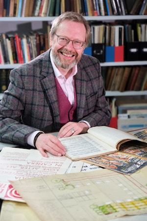

*These pages relate to the Ayckbourn Collection at Scarborough Museums & Galleries. This is a curated collection of material relating to Alan Ayckbourn, Stephen Joseph and the development of theatre in the round in Scarborough donated to the town by the playwright and his archivist, Simon Murgatroyd.*

### An Archivist's Note

*by Simon Murgatroyd*

<aside>

### Related Pages

*Alan Ayckbourn's Archivist, Simon Murgatroyd, with the Ayckbourn Collection (© Tony Bartholomew)*

</aside>

It has long been an ambition to see a collection relating to Alan Ayckbourn held in his adopted home town of Scarborough.

I've been the playwright's archivist since 2005 and in 2011 saw the huge and comprehensive Ayckbourn Archive be acquired for the nation to be held by the Borthwick Institute for Archives at the University of York. Ever since then, I've held hope that some smaller collection could be held in the town which has been so significant to the playwright and vice versa.

True, the Stephen Joseph Theatre holds an extensive archive with much material relating to Alan Ayckbourn - particularly subsequent to the mid 1970s. But it is a private archive largely for the SJT's own use and benefit.

Having stepped down as the SJT's Archivist in 2022, I set my mind to realising this long-held ambition and, with the support and agreement of the Borthwick Institute for Archives, I began to curate a small but significant collection of approximately 50 items which could be donated to the town.

The collection, of course, began with the key item of am original manuscript of Alan Ayckbourn's first play, *The Square Cat*, and developed from there encompassing a number of rare manuscripts - such as a complete set of original rehearsals scripts for the world premiere of *The Norman Conquests* - with occasional additions of items from my personal collection.

It also seemed to me important to include material relating to Stephen Joseph, founder of the UK's first professional theatre in the round company in Scarborough, and the person who is the single most influential person in Alan Ayckbourn's life - both mentor and father figure.

Key among these was there decision to donate Stephen Joseph's unrealised plans for his 'Fish and Chip Theatre', a design specifically inspired by his time in Scarborough which was both hugely innovative in its design and aspirations but also clearly showed his desire for the democratisation of theatre to make it appealing and approachable to as wide an audience as possible.

In January 2023, I approached the Chief Executive of Scarborough Museums and Galleries, Andrew Clay, who showed immense enthusiasm about acquiring the collection for the town and as I met other members of the team - particularly the Collections Manager Jim Middleton - it became obvious this enthusiasm was shared and this was the right place for the Collection.

Along the way, it opened the door to a portrait of Sir Alan by John Bratby being loaned to the Art Gallery for an exhibition, which in itself led to the portrait becoming part of the permanent donation.

This all came together in August 2023 with the announcement of the acquisition of the Ayckbourn Collection by Scarborough Museums and Galleries. Six months of work but a dream of more than a decade finally realised.

It also coincided with the recent launch of my new website, A Round Town at **[www.theatre-in-the-round.co.uk](http://www.theatre-in-the-round.co.uk/)** which looks at the history of theatre in the round in Scarborough. A fortuitous coincidence but one which further highlights the importance of Alan Ayckbourn, Stephen Joseph and theatre in the round to the cultural heritage and history of Scarborough.

I'm delighted the Ayckbourn Collection has a home in Scarborough and I hope to be working with it and Scarborough Museums and Galleries in the years to come, exploring just what theatre in the round and Alan Ayckbourn means to Scarborough.

I'd like to thank Gary Brannan at the Borthwick Institute for supporting this and Andrew Clay and his team at Scarborough Museums and Galleries for their enthusiasm for acquiring the Collection for Scarborough.

And, of course, to Sir Alan and Lady Ayckbourn for listening to and supporting my idea for the Collection and donation and allowing me to facilitate this wonderful new addition to Scarborough's collections. It's been a privilege to have initiated and guided this project.

*Simon Murgatroyd*  
*Alan Ayckbourn's Archivist*  
*August 2023*  
   The Ayckbourn Collection pages of Alan Ayckbourn's Official Website have been created in partnership with **[Scarborough Museums and Galleries](http://scarboroughmuseumsandgalleries.org.uk/)**, home of The Ayckbourn Collection since 2023. Facilitated by Simon Murgatroyd M.A. and donated by Sir Alan and Lady Ayckbourn, this collection of material celebrates the contribution of Alan Ayckbourn, Stephen Joseph and theatre in the round to Scarborough's theatrical history and heritage.
