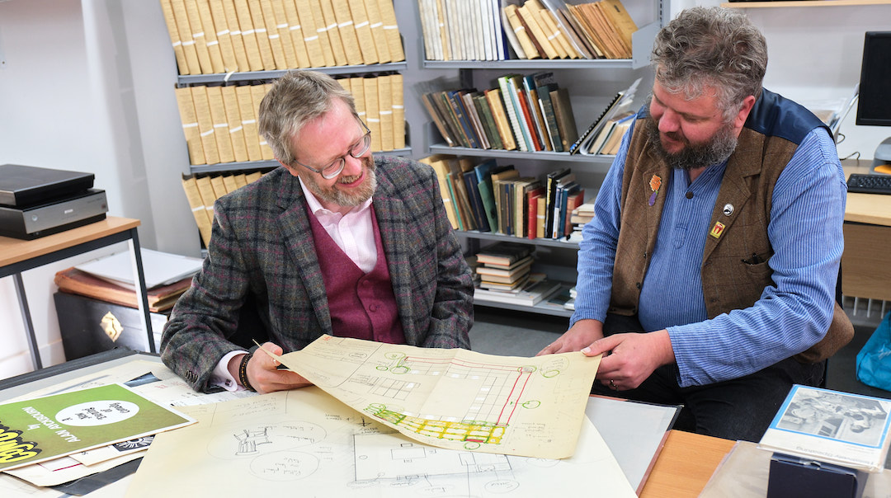

*These pages relate to the Ayckbourn Collection at Scarborough Museums & Galleries. This is a curated collection of material relating to Alan Ayckbourn, Stephen Joseph and the development of theatre in the round in Scarborough donated to the town by the playwright and his archivist, Simon Murgatroyd.*

### The Ayckbourn Collection

<aside>

### Related Pages

*Alan Ayckbourn's Archivist, Simon Murgatroyd, with Scarborough Museums & Galleries Collections Manager, Jim Middleton (© Tony Bartholomew)*

</aside>

As Alan Ayckbourn's Archivist, I'm delighted to have been able to suggest and facilitate the donation of Scarborough's first permanent and public collection of material relating to Alan Ayckbourn to Scarborough Museums and Galleries to be kept in perpetuity for the town with which Sir Alan is most closely associated with.

Since August 2023, Scarborough Museums and Galleries has held the Ayckbourn Collection, a curated collection drawn from Alan Ayckbourn and Simon Murgatroyd's personal collections of significant items relating to the playwright, his mentor Stephen Joseph and the development of theatre in the round in Scarborough.

Initially - for it is hoped the Collection will be expanded in the future - the Collection consists of approximately 50 items including an original copy of Alan Ayckbourn's first play, *The Square Cat*. There are also other rare and valuable manuscripts, published work, posters, programmes, plans, drawings and other ephemera.

This is the only collection relating to Alan Ayckbourn held in a public collection within his home town. The Ayckbourn Collection has been supported by the Borthwick Institute of Archives at the University of York where the more extensive Ayckbourn Archive is held.

Items held in the Ayckbourn Collection include…

○ Original production manuscripts for the world premiere of Alan Ayckbourn's *The Square Cat*, *The Sparrow*, *Absurd Person Singular*, *The Norman Conquests* and the original three-act version of S*eason's Greetings*.  
○ Alan Ayckbourn's personal first edition of *Relatively Speaking*; the first Ayckbourn play to be published.  
○ Rare programmes and posters for some key Ayckbourn works during the Theatre in the Round at the Library Theatre period (1957 - 1976).  
○ A variety of first edition published Ayckbourn works including editions translated into German, French and Japanese.  
○ Stephen Joseph's ground plan for Harold Pinter's directorial debut, *The Birthday Party*, in 1958.  
○ A ground plan for Theatre in the Round at the Library Theatre by Stephen Joseph.  
○ Stephen Joseph's designs for his 'Fish & Chips Theatre'.  
○ Stephen Joseph's scrapbooks relating to the formative years of Theatre in the Round at the Library Theatre, Scarborough.  
○ Other ephemera such as an example of Alan Ayckbourn's little know crystal glass first night gifts, Stephen Joseph's birth certificate and a letter from the actress Hermione Gingold to her son, Stephen Joseph.

This list is not comprehensive and a more complete guide to the Archive can be found in the Catalogue for the collection by clicking **[here](http://www.library.manchester.ac.uk/rylands/)**.

It is hoped more items will be added to the Collection over time and it is currently proposed that the entire personal collection of Alan Ayckbourn's archivist, Simon Murgatroyd, will eventually be donated to Scarborough Museums and Galleries.

*Simon Murgatroyd, August 2023*  
   The Ayckbourn Collection pages of Alan Ayckbourn's Official Website have been created in partnership with **[Scarborough Museums and Galleries](http://scarboroughmuseumsandgalleries.org.uk/)**, home of The Ayckbourn Collection since 2023. Facilitated by Simon Murgatroyd M.A. and donated by Sir Alan and Lady Ayckbourn, this collection of material celebrates the contribution of Alan Ayckbourn, Stephen Joseph and theatre in the round to Scarborough's theatrical history and heritage.
