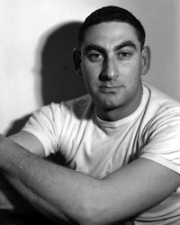

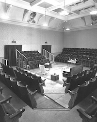

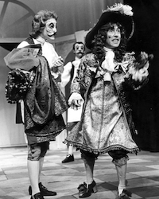

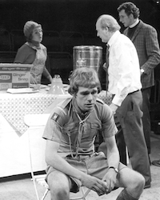

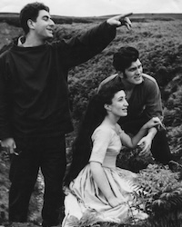

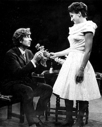

Celebrating 70 Years of  
Theatre in the Round at the Library Theatre

In 1955, Stephen Joseph launched the UK's first professional theatre in the round company in Scarborough Library. Theatre in the Round at the Library Theatre opened on 14 July 1955 and ran until 1976 until its first change of home.

From 1 May - 27 June 2026, a photographic exhibition celebrating the 21 years theatre in the round was resident in Scarborough will return to Scarborough Library. Previously displayed during July 2025, the exhibition has been updated with more photographs, half off which are new for 2026 and many of which have never been exhibited before.

The Library Theatre at 70 Exhibition

**Dates:** Friday 1 May - Saturday 27 June 2026 - **Free Entry**  
**Hours:** Open during normal library opening hours  
**Location:** First Floor, Scarborough Library, Vernon Road, Scarborough

**Organisers:** Simon Murgatroyd M.A. & North Yorkshire Council in association with **[www.a-round-town.com](http://www.a-round-town.com/)**

An exhibition of photographs celebrating the significance of Scarborough Library in British theatre history. Here, at Scarborough Library in 1955, Stephen Joseph launched the UK's first professional theatre-in-the-round company where, for 21 years, the company thrived first under Stephen Joseph and, later, under his protégé, Alan Ayckbourn.

During that 21 years, the Library Theatre saw the world premiere of some of Alan Ayckbourn's most acclaimed works - many of which are considered classics of late 20th century British theatre - including *Relatively Speaking*, *Absurd Person Singular*, *The Norman Conquests* and *Bedroom Farce*.

**New for 2026:** The exhibition has been expanded from 70 to more than 90 photos with more than half new for 2026, many of which have never been on public display before.

The exhibition includes photographs of:

- A production photograph from every year between 1955 - 1976.
- A production from every Ayckbourn play premiered at The Library Theatre.
- Acting company photographs.
- Life behind-the-scenes and out and about for the theatre and company.
- Key figures at The Library Theatre between 1955 and 1976.
- Images from the final night on

The exhibition is organised by Alan Ayckbourn's archivist and theatre historian Simon Murgatroyd in association with Scarborough Library and North Yorkshire Council.

If you have an enquiry about the exhibition, please contact Simon Murgatroyd at: **[admin@alanayckbourn.net](mailto:admin@alanayckbourn.net)**.

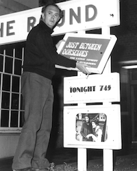

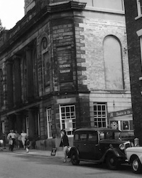

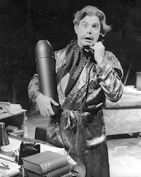

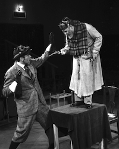

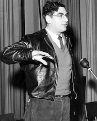

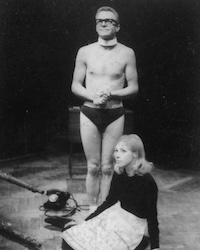
